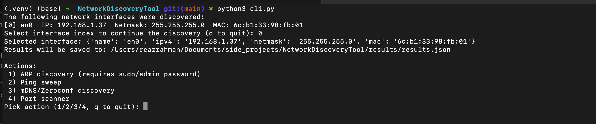
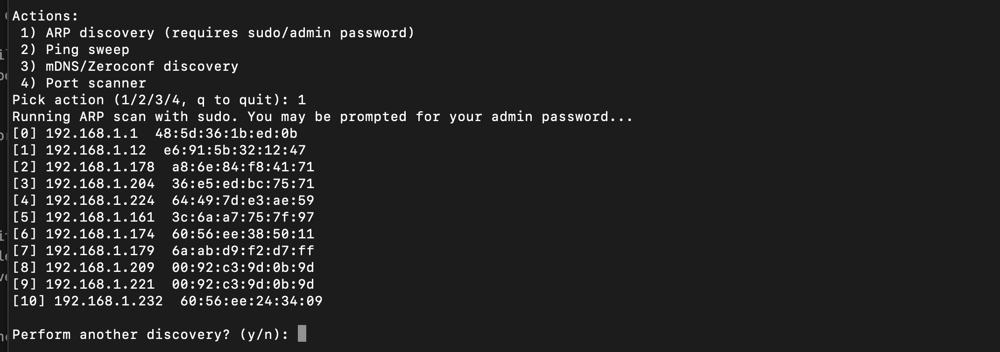
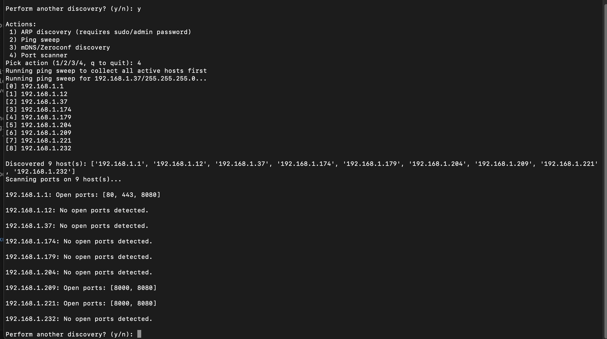

# Network Discovery Tool

A comprehensive CLI tool for discovering and analyzing devices on local networks using ARP scanning, ping sweeps, mDNS/Zeroconf discovery, and port scanning. All results are persisted to JSON for further analysis.

## ⚠️ Important Warnings

### Permissions & Privileges
- **ARP scanning requires root/sudo privileges** due to raw packet access via Scapy
- Port scanning and ping sweeps run as the current user
- Always ensure you have permission before scanning networks you do not own

### Network Scanning Ethics
- Only scan networks you own or have explicit permission to scan
- The tool uses conservative timeouts (1-3 seconds per operation) to minimize network impact
- Ping sweeps send ICMP echo requests; port scans attempt TCP connections only to common service ports
- These patterns are standard network administration tools and should not trigger security alerts on properly maintained networks
- However, aggressive scanning can be flagged as suspicious—use responsibly

## Quick Start

### Prerequisites
- Python Python 3.11.9 (used for development)
- macOS or Linux (developed on macOS, should work on Linux but not tested)
- Virtual environment (recommended)

### Installation

```bash
# Clone or navigate to the project directory
cd NetworkDiscoveryTool

# Create and activate virtual environment
python3 -m venv .venv
source .venv/bin/activate

# Install dependencies
pip install -r requirements.txt
```

### Run the CLI

```bash
python3 cli.py
```

**Flow:**
1. Select a network interface from the list
2. Choose a discovery action:
   - **1) ARP Discovery** – Scans the subnet for MAC/IP pairs (requires `sudo`)
   - **2) Ping Sweep** – Finds responsive hosts via ICMP
   - **3) mDNS Discovery** – Discovers services advertised via Zeroconf (AirPlay, HTTP, printers, etc.)
   - **4) Port Scanner** – Scans common ports on discovered hosts
3. Results are saved to `results/results_YYYY-MM-DD_HHMMSS.json`
4. Continue with more discoveries or exit

## Libraries Used & Rationale

| Library | Version | Purpose | Why Chosen |
|---------|---------|---------|-----------|
| `scapy` | Latest | Raw ARP packet crafting & sending | Industry-standard for low-level network operations; native support for ARP with timeout control |
| `asyncio` | Built-in | Concurrent ping & port operations | Native Python support; ping sweep and port scans benefit from I/O concurrency |
| `zeroconf` | Latest | mDNS/Zeroconf service discovery | Pure-Python implementation; reliable for local service enumeration without external dependencies |
| `psutil` | Latest | Network interface enumeration | Cross-platform interface info; handles MAC, IP, and netmask retrieval cleanly |
| `ipaddress` | Built-in | IPv4 subnet math | Standard library; clean CIDR notation parsing for ARP/ping subnet calculation |

## Project Structure

```
NetworkDiscoveryTool/
├── cli.py                  # Main interactive CLI
├── results_manager.py      # JSON persistence layer
├── network_interface.py    # Interface enumeration
├── arp.py                  # ARP scanning
├── ping_sweep.py           # Async ping sweep
├── dns_discovery.py        # mDNS service discovery
├── port_scanner.py         # Async port scanning
├── results/                # Output JSON files 
└── README.md
```

## Key Challenges & Solutions

### Challenge 1: Subprocess Output Capture for ARP
**Problem:** `arp.py` outputs both human-readable indexed format and JSON data. Capturing JSON for programmatic use while preserving console output was tricky.

**Solution:** Modified `arp.py` to output JSON to stdout, then `cli.py` parses the JSON, extracts IPs/MACs, prints indexed format for user, and saves structured data to results file. This separates concerns (CLI UI vs. data persistence).

### Challenge 2: Sudo + Password Prompting via Subprocess
**Problem:** Running `arp.py` with `sudo` via subprocess doesn't show password prompt to user.

**Solution:** Used `subprocess.run(..., capture_output=True, text=True)` to capture output, but this hides prompts. Trade-off: User is shown "You may be prompted..." message; if password is needed, it may timeout or fail silently. Future work: use `pty` or `sudo -S` with proper stdin handling.

### Challenge 4: Async Event Loop Lifecycle in mDNS
**Problem:** Zeroconf listener collects services asynchronously; need to ensure all pending tasks complete before returning.

**Solution:** Fixed sleep duration (10 seconds) to allow adequate discovery time, then close the connection. Result: may miss services discovered after 10 seconds, but guarantees safe shutdown.

## Intentional Trade-offs & Limitations

| Limitation | Reason | Potential Future Work |
|-----------|--------|----------------------|
| **Port scanner uses ping sweep only** | Simplified logic; ping sweep is faster than ARP for finding active hosts | Support both ARP and ping sweep as discovery options; let user choose |
| Fixed 10-sec mDNS listen timeout | Simplifies async lifecycle; users can re-run if needed | Add configurable duration or manual stop prompt |
| Port scanner limited to 7 common ports | Reduces scan time; covers most IoT/service ports | Expose customizable port list via CLI argument; add filter options |


## Future Enhancements

- [ ] **Port scanner improvements:** Support both ARP and ping sweep as discovery options
- [ ] **SSDP / UPnP discovery:** Discover devices and services via UPnP on selected interfaces
- [ ] **MQTT listener:** Basic listener to subscribe to wildcard topics and log device announcements
- [ ] **Live UI updates:** Simple progress bar or updating display (using `rich`, `textual`, or plain prints)
- [ ] **Filter options:** Allow users to filter results (e.g., only scan certain ports, look for specific service types)
- [ ] **Automated test suite (pytest)
- [ ] **Improved sudo handling (pty-based or password cache)

## AI Assistance Documentation

**Tool Used:** Claude Haiku (via VS Code GitHub Copilot) and Gemini/ChatGPT to understand the high level networking concepts such as ARP, DNS Discovery etc. 

### Generated Code
- Full `cli.py` structure and discovery function shells
- `results_manager.py` JSON persistence logic
- Refactoring of `ping_sweep.py`, `arp.py` to expose reusable functions

## Sample Use
A video_demo file is attached with this repository: `video_demo.mov`




---

**Developed with AI assistance (Claude Haiku via GitHub Copilot)**  
**Last Updated:** February 25, 2026
